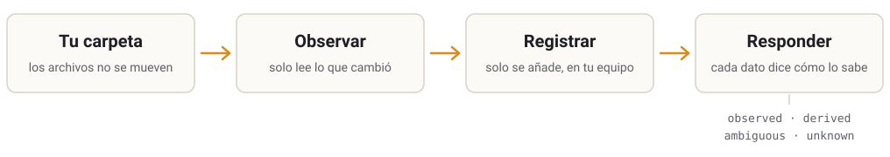

<p align="center">
  <picture>
    <source media="(prefers-color-scheme: dark)" srcset="assets/brand/logo-dark.svg">
    
  </picture>
</p>

<h3 align="center">Tus archivos, tu proyecto — humanos e IA trabajando juntos<br>sin confundir una suposición con un hecho.</h3>

<p align="center">
  <a href="README.md">English</a> · <b>Español</b>
</p>

<p align="center">
  <a href="LICENSE"></a>
  <a href="https://github.com/135Andres/Umbral/actions/workflows/umbral.yml"></a>
  <a href="docs/versions/v0.2.md"></a>
  
</p>

---

> La documentación técnica del proyecto está en inglés. Esta página es la puerta de entrada en
> español; los enlaces llevan a los documentos originales.

## El problema

Le preguntas a un asistente de IA si el contrato cambió desde ayer. Te dice que *no*, con total
seguridad. Nunca leyó el archivo: solo miró la fecha. Nada en su respuesta te lo advierte.

Una persona nueva se une a tu proyecto. La carpeta está llena de notas, borradores y resúmenes.
¿Cuáles se comprobaron y cuáles son la suposición de alguien? Los archivos no lo dicen.

A medida que más trabajo se reparte entre personas e IA, la distancia entre *"lo leí"* y
*"parece que no cambió"* es donde se esconden los errores.

## La idea

Umbral deja tus archivos exactamente donde están y guarda en tu equipo un registro honesto de
ellos.

<p align="center">
  <picture>
    <source media="(prefers-color-scheme: dark)" srcset="assets/brand/how-it-works-es-dark.svg">
    
  </picture>
</p>

- **Tus archivos siguen siendo tuyos.** Umbral nunca escribe dentro de la carpeta que observa,
  nunca guarda tu contenido (solo huellas de él) y no usa red, servicios en segundo plano ni
  cuentas.
- **Cada afirmación dice de dónde sale:** `observed` (lo informó el sistema de archivos),
  `derived` (lo calculó Umbral), `ambiguous` (la evidencia admite más de una lectura, y se dice
  por qué) o `unknown` (no se puede determinar con lo observado).
- **Solo lee lo que cambió, y lo dice.** Si nada de un archivo cambió, Umbral reutiliza su
  lectura anterior y te dice qué observación leyó de verdad los bytes.

## Pruébalo

Necesitas [Rust](https://rustup.rs). Después:

```sh
git clone https://github.com/135Andres/Umbral.git
cd Umbral
cargo install --path umbral

umbral init ~/mi-proyecto      # registra la carpeta
umbral observe ~/mi-proyecto   # anota lo que hay
# ...trabajas un rato...
umbral observe ~/mi-proyecto   # vuelve a anotar
umbral changes ~/mi-proyecto   # qué cambió, y con qué evidencia
```

Un archivo que no cambió, observado dos veces. La segunda vez no se volvió a leer, y la salida
lo dice, junto con de dónde salió la lectura que se reutilizó:

```
derived   observation=1:docs/overview.md  hash=139e3fda7011  stability=stable  metadata=fresh  content=fresh
derived   observation=2:docs/overview.md  hash=139e3fda7011  stability=stable  metadata=fresh  content=reused  content-source=1:docs/overview.md
```

La [guía de la herramienta](umbral/README.md) (en inglés) recorre cada comando y explica cómo
leer la salida.

## Dónde está

> [!NOTE]
> **Umbral es investigación temprana.** Todavía no hay un producto que instalar ni se ha elegido
> una arquitectura. Sí hay una herramienta pequeña que funciona, y cada afirmación sobre ella
> viene con su evidencia.

| | |
|---|---|
| **Hecho** | **v0.2**: una herramienta de línea de comandos que observa una carpeta, solo lee lo que cambió y dice cómo se obtuvo cada dato ([registro](docs/versions/v0.2.md)). Antes, **V0**, un primer experimento ya congelado ([resumen](docs/versions/README.md#before-the-versions-v0-the-first-experiment)). |
| **Ahora** | Hacer que Umbral sea fácil de leer y de usar para las personas, empezando por esta página. |
| **Todavía no** | Un producto, una interfaz gráfica, integraciones con herramientas de IA. |

## Hacia dónde va

Umbral pretende ser un entorno local y de código abierto donde tu proyecto vive como *tus
archivos y carpetas*, y donde personas y varios sistemas de IA (de distintos proveedores,
incluidos algunos que aún no existen) pueden trabajar en el mismo proyecto sin que nadie tenga
que reorganizarlo según lo que supone una IA. Cuatro compromisos le dan forma:

- **Tu sistema de archivos es la fuente de verdad.** Cualquier índice es una proyección
  desechable.
- **Sin taxonomía obligatoria.** Tu estructura actual, por desordenada que sea, tiene que seguir
  funcionando.
- **La IA participa; no es una función más.** Umbral hace que el proyecto compartido sea legible
  para todos los que trabajan en él; no piensa por ti.
- **Tú decides.** Umbral registra e informa, también lo que es desconocido o está en disputa. No
  decide qué es verdad.

Nada de esto está construido todavía. [Dónde está el proyecto](docs/canonical/PROJECT-DIRECTION.md)
y la [visión](docs/canonical/VISION.md) (en inglés) dicen qué está decidido y qué sigue abierto.

## Saber más

| Si quieres… | Empieza aquí |
|---|---|
| usar la herramienta | [Guía de la herramienta](umbral/README.md) |
| entender el proyecto | [Dónde está](docs/canonical/PROJECT-DIRECTION.md) · [Visión](docs/canonical/VISION.md) · [Toda la documentación](docs/README.md) |
| revisar la evidencia | [Registros de versión](docs/versions/README.md) · [Experimentos](experiments/) · [Decisiones](docs/decisions/DECISIONS.md) |
| fiarte de lo que dice este repositorio | [Reading this repository](docs/READING-THIS-REPOSITORY.md): cómo se ordenan las afirmaciones, cómo se nombran las fuentes y cómo se desarrolla |
| colaborar | [Contribuir](CONTRIBUTING.md) |
| trabajar en él como agente de IA | [AGENTS.md](AGENTS.md) |
| informar de una vulnerabilidad | [Seguridad](SECURITY.md); por favor, no abras una issue pública |

Umbral lo desarrolla su dueño junto con agentes de IA, y sus reglas existen precisamente por
eso: lo que produce un agente nunca es autoridad, y solo el dueño registra una decisión.

## Licencia

[GPL-3.0-or-later](LICENSE) ([`UD-028`](docs/decisions/DECISIONS.md)). Todo lo que se construya
sobre Umbral y se distribuya sigue siendo código abierto en los mismos términos. Las copias
obtenidas antes bajo la Apache License 2.0 conservan esa licencia.
