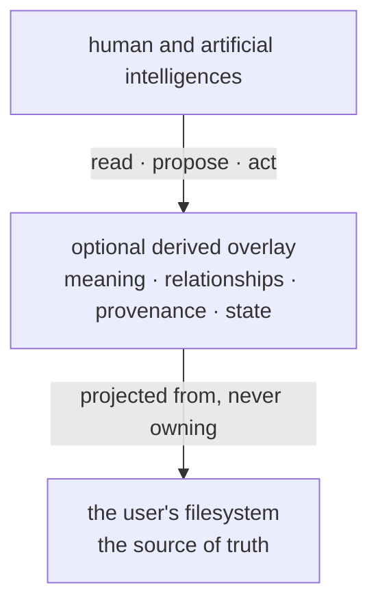
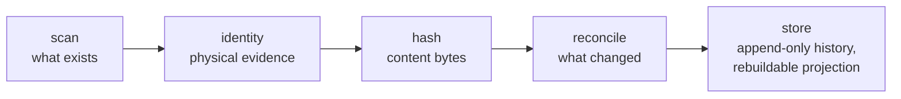

# Umbral

**Umbral is an open-source, local-first, AI-native project environment for making the
reality of an environment legible to multiple intelligences — human and artificial —
while keeping organization and authority in the user's hands.**

> **Research project.** No architecture selected. No product. A frozen proof-of-concept
> (V0) exists under [`fsp-check/`](fsp-check/). V1 has not started and is not authorized.

## What is Umbral?

Umbral is an intended open-source, local-first workspace whose human mental model is
*"my files and folders"*. Projects, tasks, decisions, knowledge and AI capabilities are
meant to live as an **optional, derived, rebuildable overlay** over a filesystem the user
already owns — not as a mandated taxonomy, and not inside a proprietary database.

The files stay the user's. The overlay is a projection that can be discarded and rebuilt.

## Why?

Today the human organizes files, and AI has to ingest them wholesale. Knowledge tools
demand a taxonomy up front, or swallow files into a database that outlives nothing. Both
put the maintenance burden on the person, and both make the environment harder — not
easier — for the *next* participant, human or artificial, to understand.

Umbral starts from the opposite assumption: the filesystem is already the shared reality,
and what is missing is a truthful, portable account of it.

Four commitments define the shape of the project:

- **Filesystem sovereign.** Files are the source of truth; any index is a disposable
  projection.
- **No mandatory taxonomy.** Existing, messy, arbitrary structure must remain workable.
- **Intelligence as a participant, not a feature.** Several AI systems — from different
  vendors, some not yet existing — are expected to share one environment. Umbral's job is
  to make that environment legible to them, not to think on the user's behalf.
- **User authority.** The project records; it does not decide what is true. Its tools
  observe, derive, and report — including reporting that something is unknown, ambiguous,
  or disputed.

## What exists today

| | |
|---|---|
| Product | **does not exist.** There is no usable application to install |
| Architecture | **not selected.** No database, protocol, versioning engine, UI or semantic model has been chosen |
| Prototype | **V0 exists and is frozen**, status `PARTIAL` — see below |
| Development | **v0.1 exists** as a local, read-only observation instrument under [`umbral/`](umbral/); its evidence is registered, and it is **not declared complete** |
| Phase | DISCOVERY → RESEARCH → ARCHITECTURE |
| Next | V1 is **not started** and is not authorized |

Two names that look alike and are not. **V0** is the frozen experiment `fsp-check/`. **v0.1**
is the first development version, in new code that does not depend on it. V0 is evidence for
v0.x; it is never a dependency of it.

## V0 — the first experiment

`fsp-check/` is a small Rust prototype that asked one narrow question:

> Can a filesystem be observed, identified, content-verified, reconciled and persisted
> deterministically and safely — **without pretending to know what the files mean?**

- **Tested:** 68 tests; 512 generated property-test cases checked against an independent
  oracle; real process-kill crash trials; benchmarks recorded as evidence. One test
  originally encoded an assumption about the filesystem (that a freed inode is never
  reused) and failed on ext4 — found by the CI runner, corrected in the test, and recorded
  as finding F-6 rather than quietly fixed.
- **Result:** no implementation failure was produced inside the tested scope. The findings
  were in the harness, the oracle, or the tests — never in the prototype. They are
  enumerated, with their class, in the falsification report.
- **Frozen state:** `PARTIAL`. The only gap is a reader-facing surface that would let a
  new reader reconstruct what the prototype recorded and when — deliberately outside V0's
  mandate.

> **V0 evidence ≠ Umbral architecture.** `fsp-check` is an experiment with a result. It is
> not "the Umbral engine", it is not the product's design, and nothing in it is a
> commitment about how Umbral will be built.

Full evidence: [`experiments/v0-harness/V0-CLOSEOUT.md`](experiments/v0-harness/V0-CLOSEOUT.md)
(scope statement, criteria, limitations, open questions, V1 handoff).

## Documentation

The project's memory is its documentation: what it intends, what must stay true, what is
required, what constrains it, what is hypothesised, what is unknown, and what has been
decided. Each file has one role; nothing duplicates another.

| Where | What |
|---|---|
| [`docs/`](docs/README.md) | the working documentation, grouped by function — with a map of its own |
| [`docs/canonical/`](docs/canonical/PROJECT-DIRECTION.md) | where the project stands; vision, principles, invariants, requirements, constraints |
| [`docs/decisions/DECISIONS.md`](docs/decisions/DECISIONS.md) | **the only place commitments live** (`UD-nnn`) |
| [`docs/candidates/`](docs/candidates/ARCHITECTURE-HYPOTHESES.md) | candidate architectures, open questions, research agenda — all explicitly *not selected* |
| [`docs/v0/`](docs/v0/V0-IMPLEMENTATION-PLAN.md) | the V0 plan, invariants and criteria |
| [`docs/versions/`](docs/versions/README.md) | what each development version did, with its evidence and its known limitations |
| [`research/`](research/) | evidence: research artifacts, external briefs, frozen history |
| [`experiments/`](experiments/) | experiments and their results, including V0 |

### How to read claims here

This repository distinguishes, on purpose and in writing, between what is established and
what is not. The authority ladder, highest first — a lower level never overrides a higher
one:

1. An explicit current instruction from the project owner
2. A decision record — [`DECISIONS.md`](docs/decisions/DECISIONS.md), `UD-nnn`
3. The founding charter (cited as `MC §n`; see [Naming and sources](#naming-and-sources))
4. Canonical knowledge — `PROJECT-DIRECTION`, `VISION`, `INVARIANTS`, `PRINCIPLES`,
   `REQUIREMENTS`, `CONSTRAINTS`
5. An experiment result — evidence, not a decision
6. A research artifact — attributed, unratified
7. A hypothesis or interpretation — `ARCHITECTURE-HYPOTHESES`, `OPEN-QUESTIONS`
8. Session history, agent memory, model inference

Rules that follow from it:

- **Model output is never authority** — no matter which model produced it, including the
  agents that maintain this repository.
- **Research does not override the owner.** A recommendation stays a recommendation.
- **Conflicts are preserved**, never silently resolved.
- **Every claim cites a source**: `MC §n`, `UD-nnn`, `A-n`, `R-n`, `C-n`, `P-n`, `H-n`,
  `Q-n`, `T-n`, `EXP-n`. Unidentifiable origin is marked `UNKNOWN`.
- **Evidence is kept when it is unflattering.** Negative results, rejected hypotheses and
  superseded decisions stay in the record.

## Naming and sources

**Umbral** is the public name of the project. It was previously developed under the
working name **FSP** (*File System Pro*), and `fsp-check` — the frozen V0 prototype — keeps
that name. Historical records (`research/history/`, experiment logs) and dated research
artifacts retain the working name as written; they are not rewritten.

The founding charter is the project owner's own document. It is cited throughout as
`MC §n` and is **not part of the public edition of this repository**; the canonical
documents in [`docs/`](docs/README.md) carry its load-bearing content, each with its
`MC §n` citation preserved. Where a citation cannot be checked publicly, that is stated
rather than hidden.

This repository's history was rewritten once, before its first public release, to remove a
document that is not part of the public edition. That is why no commit hash is cited
anywhere in this repository: the rewrite changed all of them, and a hash written down
afterwards would have been wrong. The development trail — what was done, in what order,
with what evidence — is preserved.

## How this project is developed

Umbral is developed by its owner together with AI agents, and the commit history says so:
the commits in this repository were authored by an agent identity, and the project has not
rewritten that history to look otherwise.

The project's own rules exist precisely because of this. Agent output — including the
output of the agents that wrote and maintain these documents — is **never authority**:
research is attributed and unratified, proposals stay proposals, and only the project owner
can record a decision. Where an agent's claim and a document here disagree, the document
wins; where neither is established, the answer is recorded as unknown.

## Contributing

Contributions are welcome. Read [`CONTRIBUTING.md`](CONTRIBUTING.md) first — in
particular, the rules that keep decisions, hypotheses, evidence and experiments from being
confused with one another.

## Security

See [`SECURITY.md`](SECURITY.md). Please do not open a public issue for a vulnerability.

## License

[Apache License 2.0](LICENSE). Dependency licenses are their own; nothing here claims
otherwise.

## Project status

This is an early research project, published for transparency rather than for use. It has
no release, no stability promise, and no support commitment. Interfaces, documents and
even names may change. The prototype under `fsp-check/` is experimental infrastructure:
it is kept as evidence of what was tested, not as a foundation to build on.

If you are looking for a product to install, there isn't one yet.
