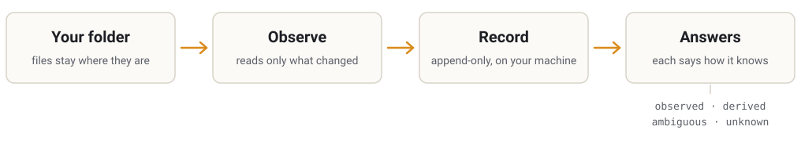

<p align="center">
  <picture>
    <source media="(prefers-color-scheme: dark)" srcset="assets/brand/logo-dark.svg">
    
  </picture>
</p>

<h3 align="center">Your files, your project — humans and AI working together<br>without mistaking a guess for a fact.</h3>

<p align="center">
  <b>English</b> · <a href="README.es.md">Español</a>
</p>

<p align="center">
  <a href="LICENSE"></a>
  <a href="https://github.com/135Andres/Umbral/actions/workflows/umbral.yml"></a>
  <a href="docs/versions/v0.2.md"></a>
  
</p>

---

## The problem

You ask an AI assistant whether the contract changed since yesterday. It says *no*, with full
confidence. It never read the file; it only looked at the date. Nothing in its answer tells
you that.

A new person joins your project. The folder is full of notes, drafts and summaries. Which of
them were checked, and which are someone's guess? The files can't say.

As more of the work is shared between people and AI, the gap between *"I read this"* and
*"this looks unchanged"* is where mistakes hide.

## The idea

Umbral leaves your files exactly where they are and keeps an honest record of them on your
machine.

<p align="center">
  <picture>
    <source media="(prefers-color-scheme: dark)" srcset="assets/brand/how-it-works-dark.svg">
    
  </picture>
</p>

- **Your files stay yours.** Umbral never writes inside the folder it observes, never stores
  your content (only fingerprints of it), and has no network, daemon or account.
- **Every statement says where it came from:** `observed` (the filesystem reported it),
  `derived` (Umbral computed it), `ambiguous` (the evidence allows more than one reading,
  and the reason is named) or `unknown` (it can't be determined from what was seen).
- **It reads only what changed, and says so.** When nothing about a file changed, Umbral
  reuses its earlier reading and tells you which observation actually read the bytes.

## Try it

You need [Rust](https://rustup.rs). Then:

```sh
git clone https://github.com/135Andres/Umbral.git
cd Umbral
cargo install --path umbral

umbral init ~/my-project      # register the folder
umbral observe ~/my-project   # record what is there
# ...work for a while...
umbral observe ~/my-project   # record again
umbral changes ~/my-project   # what changed, and on what evidence
```

A file that did not change, observed twice. The second time it was not read again, and the
output says so — and where the reading it reused came from:

```
derived   observation=1:docs/overview.md  hash=139e3fda7011  stability=stable  metadata=fresh  content=fresh
derived   observation=2:docs/overview.md  hash=139e3fda7011  stability=stable  metadata=fresh  content=reused  content-source=1:docs/overview.md
```

The [tool guide](umbral/README.md) walks through every command and shows how to read the output.

## Where it stands

> [!NOTE]
> **Umbral is early research.** There is no product to install yet, and no architecture has
> been chosen. There *is* a small tool that works, and every claim about it comes with its
> evidence.

| | |
|---|---|
| **Done** | **v0.2** — a command-line tool that observes a folder, reads only what changed, and states how every value was obtained ([record](docs/versions/v0.2.md)). Before it, **V0**, a frozen first experiment ([summary](docs/versions/README.md#before-the-versions-v0-the-first-experiment)). |
| **Now** | Making Umbral easy for people to read and use — starting with this page. |
| **Not yet** | A product, a graphical interface, integrations with AI tools. |

## Where it's going

Umbral is meant to become a local-first, open-source environment where your project lives
as *your files and folders*, and where people and several AI systems — from different
vendors, including ones that don't exist yet — can work on the same project without anyone
reorganizing it around one AI's assumptions. Four commitments shape it:

- **Your filesystem is the source of truth.** Any index is a disposable projection of it.
- **No mandatory taxonomy.** Your existing, messy structure has to keep working.
- **AI is a participant, not a feature.** Umbral makes the shared project readable to
  everyone in it; it doesn't think on your behalf.
- **You stay in charge.** Umbral records and reports — including what is unknown or
  disputed. It doesn't decide what is true.

None of this is built yet. [Where the project stands](docs/canonical/PROJECT-DIRECTION.md)
and the [vision](docs/canonical/VISION.md) say what is decided and what is still open.

## Learn more

| If you want to… | Start here |
|---|---|
| use the tool | [Tool guide](umbral/README.md) |
| understand the project | [Where it stands](docs/canonical/PROJECT-DIRECTION.md) · [Vision](docs/canonical/VISION.md) · [All documentation](docs/README.md) |
| check the evidence | [Version records](docs/versions/README.md) · [Experiments](experiments/) · [Decisions](docs/decisions/DECISIONS.md) |
| rely on what this repository says | [Reading this repository](docs/READING-THIS-REPOSITORY.md) — how claims are ranked, how sources are named, how it is developed |
| contribute | [Contributing](CONTRIBUTING.md) |
| work on it as an AI agent | [AGENTS.md](AGENTS.md) |
| report a vulnerability | [Security](SECURITY.md) — please don't open a public issue |

Umbral is developed by its owner together with AI agents, and its rules exist because of
that: agent output is never authority, and only the owner records a decision.

## Licence

[GPL-3.0-or-later](LICENSE) ([`UD-028`](docs/decisions/DECISIONS.md)). Anything built on
Umbral and distributed stays open source under the same terms. Earlier copies obtained under
the Apache License 2.0 keep that licence.
